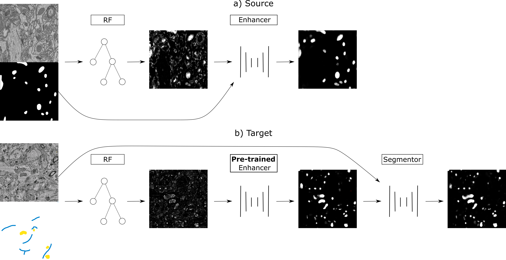

# From shallow to deep: exploiting feature-based classifiers for domain adaptation in semantic segmentation



This repository provides a PyTorch implementation of our method from the [paper](https://www.biorxiv.org/content/10.1101/2021.11.09.467925v1):

```
@article{matskevych2021shallow,
  title={From shallow to deep: exploiting feature-based classifiers for domain adaptation in semantic segmentation},
  author={Matskevych, Alex and Wolny, Adrian and Pape, Constantin and Kreshuk, Anna},
  journal={bioRxiv},
  year={2021},
  publisher={Cold Spring Harbor Laboratory}
}
```

It is a fork of the `pytorch-3dunet` of Adrian Wolny (can be found [here](https://github.com/wolny/pytorch-3dunet)) and adjusted for the following tasks:
 - Simple Random Forest training and prediction (for the Prediction Enhancer)
 - Prediction Enhancer
 - Pseudo-label Net (for further domain adaptation with pseudo-labels), including
   - Rectification losses 
   - Consistency model & losses

This module is designed to be able to work without conflict to the original fork (both should be usable at the same time).

## Installation

This library can be used with anaconda. After installing anaconda, one can create a new environment with the `environment.yml` file by running

```bash
conda env create -f environment.yaml
```

and then activate the environment after installation by running

```bash
conda activate shallow2deep
```

One can then install the `shallow2deep` library into the environment by running

```bash
pip install .
```

in the root folder.

You need to activate the environment everytime you want to use the following commands.

## Example

### RF

These steps are illustrated for the `training` dataset of the source dataset. 
Run them for every dataset you want to use. (E.g. training and validation). 
Note: The code for the creation of filters and RFs is written to work in 2D. 
This means the RFs and filters are not taking 3D information into account.

To create filters, you can run 

```bash
shallow2deep_create_filters \
   --source_path /scratch/matskevy/epfl_mitos_2d/training.h5 \
   --save_path /scratch/matskevy/epfl_to_vnc/epfl_filter_data/epfl_mitos_training_filtered.h5 \
   --raw_internal_path raw \
   --label_internal_path label
```

To maximize later enhancer performance, it is important that all RFs that are trained later use the same filters. 
You are ensuring this by running this for every dataset that you need filters for / want to train the Enhancer on. 


To generate RFs, you can run

```bash
shallow2deep_rf_generation \
   --volume_path /scratch/matskevy/epfl_to_vnc/epfl_filter_data/epfl_mitos_training_filtered.h5  \
   --rf_save_folder /scratch/matskevy/epfl_to_vnc/rf_data/epfl_training_rfs/ \
   --rf_num 200 \
   --min_patch_len 100 \
   --max_patch_len 600 \
   --label_internal_path label
```

While in the paper we used 1000 RFs, a number of 200 or 100 RFs should be sufficient for most cases.

Note: Usually, validation needs a much lesser amount of RFs (`--rf_num` can be adjusted to a single digit number),
otherwise you have to set `validate_iters` in the `trainer config` to avoid too many validation steps.


To predict with the generated RFs, you can run

```bash
shallow2deep_rf_prediction \
   --volume_path /scratch/matskevy/epfl_to_vnc/epfl_filter_data/epfl_mitos_training_filtered.h5 \
   --rf_path /scratch/matskevy/epfl_to_vnc/rf_data/epfl_training_rfs/ \
   --save_folder /scratch/matskevy/epfl_to_vnc/rf_data/epfl_training_rf_preds/ \
   --raw_internal_path raw \
   --label_internal_path label
```

This creates the RF predictions and thus the dataset for the Prediction Enhancer training.

Now the label data needs to be added to these predictions. This can be done by using the simple script

```bash
shallow2deep_add_volume_to_dataset \
  --source_file /scratch/matskevy/epfl_mitos_2d/training.h5
  --save_path /scratch/matskevy/epfl_to_vnc/rf_data/epfl_training_rf_preds/ \
  --internal_path label
```


### Prediction enhancer training

The PE is a basic U-Net that can be trained from the previously generated RF predictions. It takes the RF predictions as
'raw' and trains to infer the true 'label'. It is trained by the same principles as most U-Nets and uses the original 
functionality of the underlying `pytorch-3dunet` library. Example configs can be found in the `resources` folder:

```bash
shallow2deep_train --config /scratch/matskevy/shallow2deep/resources/2DUnet_epfl_enhancer/epfl_train_config.yml
```

### Ilastik prediction

When training in `Ilastik`, select the right filters (and right dimensions) to train the RF with self-made annotations on the target dataset.
You can then use it to make predictions for the target dataset(s) directly from `Ilastik`, or save the project and 
use the `headless mode` to predict with a command like

```bash
/scratch/matskevy/ilastik/ilastik-1.4.0b20-Linux/run_ilastik.sh \
--headless \
--project=/scratch/matskevy/epfl_to_vnc/ilastik_data/vnc/ilastik_vnc_2d.ilp \
--output_format=hdf5 \
--output_filename_format=/scratch/matskevy/epfl_to_vnc/ilastik_data/vnc_prediction/ilastik_predicted_training.h5 \
--export_source "Probabilities" \
--input_axes=zyx /scratch/matskevy/vnc_2d_mitos/training.h5/raw
```

In this case `/scratch/matskevy/ilastik/ilastik-1.4.0b20-Linux/run_ilastik.sh` is the path to `Ilastik`.

It is important to have the foreground RF prediction probabilities (not just a binary prediction) for the PE 
(as it was also trained with probabilities). With the `headless` prediction from above one can get two channels, 
with one containing the foreground and the other the background prediction probabilities.

One can use the helper script 

```bash
shallow2deep_extract_single_axis \
  --source_path /scratch/matskevy/epfl_to_vnc/ilastik_data/vnc_prediction/ilastik_predicted_test.h5 \
  --src_internal_path exported_data \
  --tgt_internal_path fg_pred \
  --axis -1 \
  --channel_num 0
```

to create foreground-prediction volumes in the prediction file with the key `fg_pred`. 

Note: Normally the probabilities in this `Ilastik` binary prediction are aligned as (fg, bg) on the last axis, 
so the default value for `axis` is `-1` and `channel_num` is `0`.

### Prediction enhancer inference

The PE can be now used on the `Ilastik` RF predictions on the target data to do inference for enhanced predictions. 
This works like the usual NN prediction in the `pytorch-3dunet` library and an example config can be found in the `resources` folder:

```bash
shallow2deep_predict --config /scratch/matskevy/shallow2deep/resources/2DUnet_epfl_enhancer/epfl_test_config.yml
```

### Pseudo-label Net training & inference

To train a full segmentor with the enhanced predictions as pseudo-labels, one needs to prepare the enhanced predictions to serve as training files.

1. Predictions have an additional channel dimension. To transform them to be the same dimension as the raw data,
one can again use 

```bash
shallow2deep_extract_single_axis \
  --source_path /scratch/matskevy/epfl_to_vnc/nn_data/enhancer/epfl_to_vnc_mito_predictions/ilastik_predicted_training_predictions.h5 \
  --src_internal_path predictions \
  --tgt_internal_path pseudo_label \
  --axis 0 \
  --channel_num 0
```

to create a volume without the channel dimension.

2. One needs to add the `raw` volume to the enhanced predictions, e.g. by running 

```bash
shallow2deep_add_volume_to_dataset \
  --source_file /scratch/matskevy/vnc_2d_mitos/training.h5 \
  --save_path /scratch/matskevy/epfl_to_vnc/nn_data/enhancer/epfl_to_vnc_mito_predictions/ilastik_predicted_training_predictions.h5 \
  --internal_path raw
```

With the datasets both containing the necessary volumes `raw` and `pseudo_label`, one can start the Pseudo-label Net training.
Example configs for training can be found in the `resources` folder. The different training scenarios include
- Pseudo-label Net training
- Pseudo-label Net training with consistency (as described in the paper)
- Pseudo-label Net training with label rectification (as described in the paper)
- Pseudo-label Net training with consistency & label rectification

```bash
shallow2deep_train --config /scratch/matskevy/shallow2deep/resources/2DUnet_vnc_pseudo_label/train/train_config_consistency_rectification.yml
```

Inference can be done as usual with the `pytorch-3dunet` library, as can be seen in the example config in the `resources` folder:

```bash
shallow2deep_predict --config /scratch/matskevy/shallow2deep/resources/2DUnet_vnc_pseudo_label/test/test_config_consistency_rectification.yml
```

## Additional information

- Set the `--unequal_filter_order` flag in the RF prediction if the RFs have different sources and as filters could have different orders.
- During filter creation, set the `--compute_boundaries` flag to compute boundaries as labels in case the original labels are a segmentation.
- Most validation metrics expect the labels to be binary, so they binarize the target before computing the metric. 
This can lead to problems during Pseudo-label Net training. To combat this, the target is rounded to the nearest
integer before passed to a validation metric. If this procedure is not wanted, 
one can set the `--do_not_round_target` flag in the `eval_metric` config.
- If consistency (as defined in the paper) is used during training, the `final_activation` is crucial during the 
training of the Pseudo-label Net. The final activation is applied to the EMA Net prediction to normalize it before 
computing the consistency loss.
